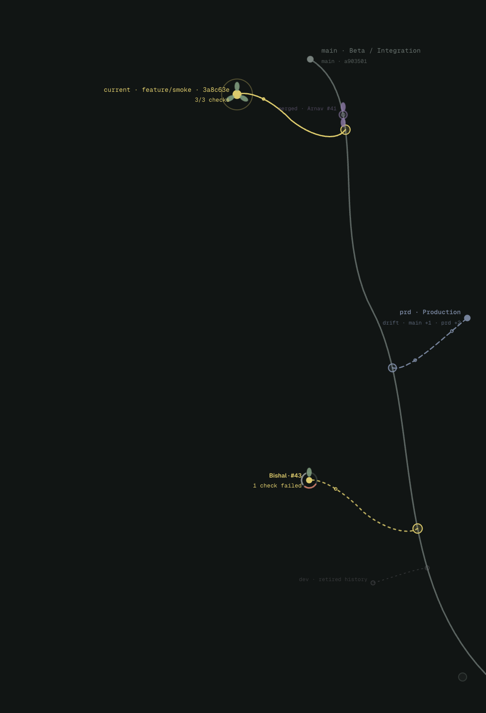
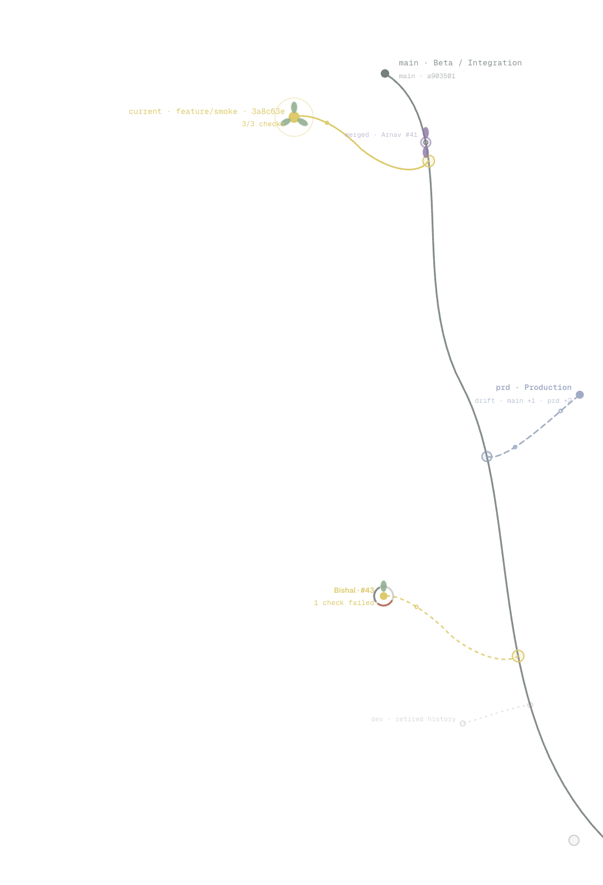

<p align="center">
  
</p>

<h1 align="center">vertebrae</h1>

<p align="center">
  <strong>Git, if it stopped hiding the interesting parts in terminal output.</strong><br />
  A transparent macOS overlay that turns repository state into a living branch landscape.
</p>

<p align="center">
  
</p>

> The botany is decorative. The ancestry is not.

## The idea

Git already knows the shape of a project: which commits share an ancestor, which branches have drifted, which pull requests are healthy, and which environment is quietly living in its own timeline. We normally ask for that shape through tables, badges, or an ASCII graph that looks like a subway map designed during an incident.

I built **vertebrae** to expose that hidden coordination system without opening another dashboard. The repository becomes an organism at the edge of the screen: integration is the spine, divergent work grows outward, checks open as petals, and merged decisions settle back into history.

This is not a metaphor pasted over arbitrary data. Every visible relationship comes from Git topology or GitHub state.

## What you are actually looking at

| Visible form | Underlying fact |
| --- | --- |
| Spine | The selected integration ref, usually `main` and preferably `origin/main` |
| Junction | The real `git merge-base` between a branch and the integration ref |
| Branch length | Commits unique to that ref, derived from `rev-list` |
| Position along the spine | Distance from the integration head to the branch point |
| Dashed ghost limb | A remote-only PR head or remembered upstream movement |
| Yellow branch | An open pull request |
| Petal | One passing GitHub check |
| Remaining ring segment | A pending or failing check that has not opened yet |
| Rust fracture | A merge conflict, with affected files available on hover |
| Purple flower | A merged pull request and its completed checks |
| Production lane | Honest divergence between integration and `prd`, `prod`, or `production` |
| Retired scar | A contained historical ref such as `dev`, preserved without pretending it is active work |

If two refs are synchronized, vertebrae puts them at the same checkpoint. If `main` and `prd` each contain unique commits, it shows the split instead of drawing a reassuring lie.

## The Fanshawe context

In the context of my work at **Fanshawe**, vertebrae is a study in exposing hidden systems.

A repository is a social system wearing a filesystem costume. The commands are easy to teach; the harder part is seeing the consequences between them—where work began, what changed upstream, whose pull request is waiting, and whether “almost merged” means one pending check or a conflict nobody has opened yet.

The project asks a broader interface question:

> What happens when infrastructure stops reporting itself as a list and starts revealing its behaviour as a shape?

That makes vertebrae useful as both a working Git companion and a conceptual representation of collaborative software development: distributed decisions made spatial, temporal, and legible.

## One topology, any surface

The overlay has no canvas of its own. It sits over the work, so its visual system has to survive both light and dark environments without turning into a sticker.

<table>
  <tr>
    <td width="50%">
      
    </td>
    <td width="50%">
      
    </td>
  </tr>
</table>

Passed checks bloom individually. Pending and failing checks keep their positions in the ring; the final pass completes the flower. The current ref ticks briefly every four seconds—not because Git needs drama, but because `HEAD` deserves to admit where it is.

## How it works

vertebrae does **not** scrape the printed output of `git log --graph`. It lays out the topology itself:

- `git for-each-ref` supplies local refs and activity;
- `git merge-base` anchors every real branch junction;
- `git rev-list --left-right --count A...B` supplies ahead/behind relationships;
- tracked remote refs reveal upstream movement and incoming commits;
- `gh` supplies pull requests, authors, mergeability, check rollups, and recent merges;
- open PR heads are fetched into the app-owned `refs/branch-organism/pr/*` namespace, never checked out into the working tree;
- Git snapshots run in a background utility process, with local state sampled every five seconds and remotes refreshed every minute.

Unchanged refs reuse the previous snapshot, and remote refreshes are queued rather than stacked. The overlay stays movable even when the repository is large or the network is having a personality.

## Run it

```bash
npm install
npm run build
npm start -- --repo=/absolute/path/to/your/repository
```

You can also set the repository through `BRANCH_ORGANISM_REPO`, or choose any folder inside a Git repository from the menu-bar control.

For renderer development with specimen data:

```bash
npm run dev:web
```

For live Electron development:

```bash
BRANCH_ORGANISM_REPO=/absolute/path/to/repository npm run dev
```

Press <kbd>Command</kbd>/<kbd>Ctrl</kbd> + <kbd>Shift</kbd> + <kbd>B</kbd> to hide or reveal the overlay.

## Build the Mac app

```bash
npm run package:share
```

This produces a Universal `.dmg` and `.zip` in `work/share`, compatible with Apple Silicon and Intel Macs. The recipient can drag **vertebrae** into Applications and choose the repository they want to observe; they do not need Node.js or this source tree.

### Requirements

- **Git** is required.
- **GitHub CLI** is optional, but enables PR branches, named checks, merge conflicts, and recent merge activity. Install it from [cli.github.com](https://cli.github.com/) and run `gh auth login` once.
- Private repositories require the same remote access they normally use.

Local builds are ad-hoc signed but not notarized. macOS may require a Control-click → **Open** on first launch. Distribution without that step requires an Apple Developer ID and notarization.

## Control surface

The menu-bar organism can:

- show or hide the overlay;
- choose and remember a repository;
- fetch immediately;
- open the remote on GitHub;
- assign the integration spine, production lane, and retired refs per repository;
- dock the tree to the right edge.

The small fading circle is the gripper. Drag it to move the organism; bring it near the right edge and it settles there.

---

vertebrae does not tell you what to do with the repository. It shows the system you are already inside.
